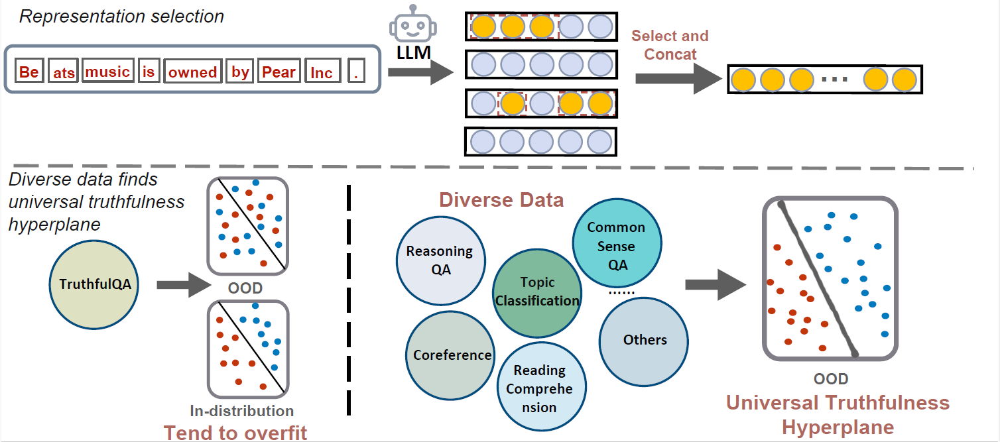

On the Universal Truthfulness Hyperplane Inside LLMs
=======================================================================


## Overview



This is the code implementation of the paper: [[On the Universal Truthfulness Hyperplane Inside LLMs](https://arxiv.org/abs/2407.08582)
]

In this paper, we examine whether a universal truthfulness hyperplane exists inside the model, through designing and training a probe on diverse datasets. Our approach greatly improves existing results and conveys positive signals on the existence of such a universal truthfulness hyperplane.


## News

Our paper is accepted by EMNLP 2024!


## Setup

```
conda env create -f environment.yml  
```


## Todo


- [x] Release data!

- [ ] Clean and release training scripts


## Citation

Please cite our paper if it's helpful to your work!

```bibtex
@article{liu2024universal,
  title={On the Universal Truthfulness Hyperplane Inside LLMs},
  author={Liu, Junteng and Chen, Shiqi and Cheng, Yu and He, Junxian},
  journal={arXiv preprint arXiv:2407.08582},
  year={2024}
}
```